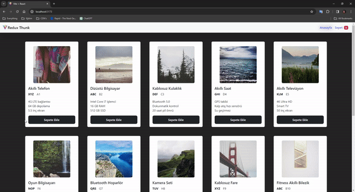

# Redux-Thunk E-Commerce

I created an e-commerce site with Redux Thunk. I used json-server to send API requests and save to-dos. I used the thunk library to perform API requests in actions, unlike normal redux.
I used bootstrap for the design.I also implemented dynamics into my application where we can add products to the cart, change their quantities, and see the total expenditure.

# Screen

# Kütüphaneler

- Bootstrap / Axios / React-router-dom / react-redux / redux / redux-thunk /json-server
